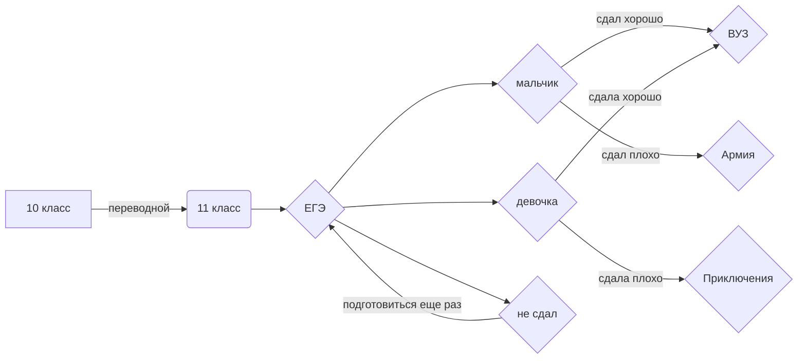

# Sukhoroslov-Pinzhina.github.io

<!--Dayspedia.com widget-->

	

	<a class="DPl" href="https://dayspedia.com/time/ru/Tomsk/" target="_blank" style="display:block!important;text-decoration:none!important;border:none!important;cursor:pointer!important;background:transparent!important;line-height:0!important;text-shadow:none!important;position:absolute;z-index:1;top:0;right:0;bottom:0;left:0">
		<svg xmlns="http://www.w3.org/2000/svg" viewbox="0 0 16 16" style="position:absolute;right:8px;bottom:0;width:16px;height:16px">
			<path style="fill: rgb(94, 0, 189);" d="M0,0v16h1.7c-0.1-0.2-0.1-0.3-0.1-0.5c0-0.9,0.8-1.6,1.6-1.6c0.9,0,1.6,0.8,1.6,1.6c0,0.2,0,0.3-0.1,0.5h1.8 c-0.1-0.2-0.1-0.3-0.1-0.5c0-0.9,0.8-1.6,1.6-1.6s1.6,0.8,1.6,1.6c0,0.2,0,0.3-0.1,0.5h1.8c-0.1-0.2-0.1-0.3-0.1-0.5 c0-0.9,0.8-1.6,1.6-1.6c0.9,0,1.6,0.8,1.6,1.6c0,0.2,0,0.3-0.1,0.5H16V0H0z M4.2,8H2V2h2.2c2.1,0,3.3,1.3,3.3,3S6.3,8,4.2,8z M11.4,6.3h-0.8V8H9V2h2.5c1.4,0,2.4,0.8,2.4,2.1C13.9,5.6,12.9,6.3,11.4,6.3z M4.4,3.5H3.7v3h0.7C5.4,6.5,6,6,6,5 C6,4.1,5.4,3.5,4.4,3.5z M11.3,3.4h-0.8V5h0.8c0.6,0,0.9-0.3,0.9-0.8C12.2,3.7,11.9,3.4,11.3,3.4z">
			</path>
		</svg>
		Powered&nbsp;by DaysPedia.com
	</a>
	
Текущее Время в городе Томск

	

		103607
	

	

		Пн., 12 Декабря<i></i>
	

	
	

		
			<svg xmlns="http://www.w3.org/2000/svg" viewbox="0 0 24 24"><path d="M12,4L7.8,8.2l1.4,1.4c0,0,0.9-0.9,1.8-1.8V14h2c0,0,0-3.3,0-6.2l1.8,1.8l1.4-1.4L12,4z"></path><path d="M6.8,15.3L5,13.5l-1.4,1.4l1.8,1.8L6.8,15.3z M4,21H1v2h3V21z M20.5,14.9L19,13.5l-1.8,1.8l1.4,1.4L20.5,14.9z M20,21v2h3 v-2H20z M6.1,23C6,22.7,6,22.3,6,22c0-3.3,2.7-6,6-6s6,2.7,6,6c0,0.3,0,0.7-0.1,1H6.1z"></path></svg>
			09:45am
		
		06:57
		
			<svg xmlns="http://www.w3.org/2000/svg" viewbox="0 0 24 24"><path d="M12,14L7.8,9.8l1.4-1.4c0,0,0.9,0.9,1.8,1.8V4h2c0,0,0,3.3,0,6.2l1.8-1.8l1.4,1.4L12,14z"></path><path d="M6.8,15.3L5,13.5l-1.4,1.4l1.8,1.8L6.8,15.3z M4,21H1v2h3V21z M20.5,14.9L19,13.5l-1.8,1.8l1.4,1.4L20.5,14.9z M20,21v2h3 v-2H20z M6.1,23C6,22.7,6,22.3,6,22c0-3.3,2.7-6,6-6s6,2.7,6,6c0,0.3,0,0.7-0.1,1H6.1z"></path></svg>
			16:42pm
		
	

	
	<!--/DPDC-->
	
<!--Dayspedia.com widget ENDS-->

<a class="iksweb" href="https://pnzhnp.github.io/"   title="Поехали!">Поехали!</a>

http://project6507954.tilda.ws/page32540229....

